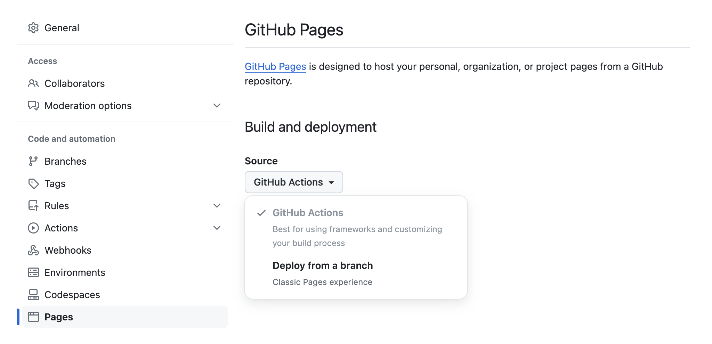
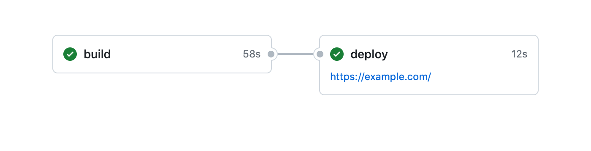

In today's fast-paced development environment, automation is a key aspect of a successful project. Automating the build and deployment processes can save time, reduce human errors, and ensure consistent and reliable releases.

GitHub Actions, a powerful workflow automation tool, enables you to automate various tasks in your software development lifecycle, including project building and deployment. In turn, GitHub Pages provides a convenient way to showcase projects, host documentation, or create personal blogs directly from your GitHub repositories.

These two tools seem to be a perfect match: by leveraging GitHub Actions, you can automate the deployment process, ensuring that your site is consistently updated with the latest changes from your repository. This article will guide you through the steps to deploy to GitHub Pages using GitHub Actions.

## TL;DR

If you're already acquainted with GitHub Actions and only need the complete workflow script, [scroll down to the script section](#step-4-review-the-final-script) or [explore it within a live project on GitHub](https://github.com/mdslides/app/blob/v1.0.0/.github/workflows/github-pages-deploy.yml).

## Prerequisites

- A GitHub repository containing your Node project
- Basic understanding of [YAML](https://en.wikipedia.org/wiki/YAML)

### Step 1: Set the deployment source

First of all, the deployment source in the repository settings must be set to "GitHub Actions".



1. Navigate to the GitHub repository settings.
2. In the "Code and automation" section of the sidebar, click "Pages".
3. Select "GitHub Actions" from the "Source" dropdown in the "Build and deployment" section.

Once the source is changed to "GitHub Actions", GitHub will suggest several starter workflows. However, this is not necessary, as we will create our own in the next steps.

### Step 2: Create a workflow file

In your project repository, navigate to the `.github/workflows` directory (create it if it's not present). Whithin this directory, create a YAML file giving it any arbitrary name (e.g., `github-pages-deploy.yml`). This file will contain the workflow configuration.

### Step 3: Configure the workflow

The following substeps will show the parts of [the config](https://docs.github.com/en/actions/using-workflows/workflow-syntax-for-github-actions) that should be added to the previously created file, along with corresponding explanations.

If you don't need an in-depth explanation, feel free to skip to [Step 4](#step-4-review-the-final-script).

#### Step 3.1: Name

```yaml
name: Deploy to GitHub Pages
```

This is the name of the workflow. It will be displayed on GitHub Actions and helps identify the purpose of the workflow.

#### Step 3.2: Trigger

```yaml
on:
  release:
    types:
      - published
```

This specifies the trigger for the workflow. The workflow will be triggered whenever a new release is published. The `published` event type means that the workflow will run when a release is created and actually published, not just when a draft release is created.

In case you need to initiate the workflow based on a different event (e.g., pushing to a specific branch), check out the other possible events in the [GitHub Docs](https://docs.github.com/en/actions/using-workflows/triggering-a-workflow).

#### Step 3.3: Permissions

```yaml
permissions:
  contents: read # for accessing the repository contents
  id-token: write # for verifying the deployment source
  pages: write # to be able deploy to GitHub Pages
```

These permissions define the access levels required by the workflow.

#### Step 3.4: Concurrency

```yaml
concurrency:
  group: github-pages
  cancel-in-progress: true
```

This ensures that only one instance of the workflow runs at a time under the same `github-pages` concurrency group. If a workflow run is already in progress, the new run will cancel the ongoing one.

#### Step 3.5: Jobs

A workflow run is made up of one or more jobs. Although the entire workflow could be done within a single job, we will deliberately split it into two: `build` and `deploy`. This separation will add some complexity to the script, since we'll need to pass the build artifact between jobs, but at the same time, it will enhance the structure of the workflow and make it more descriptive.

The expected workflow is outlined in the following picture:



For each job in the config, [the type of machine to run it on](https://docs.github.com/en/actions/using-jobs/choosing-the-runner-for-a-job) and a list of execution steps are specified. For the `deploy` job, a prerequisite job (so that `build` must complete successfully beforehand) and [a target deployment environment](https://docs.github.com/en/actions/using-jobs/using-environments-for-jobs) are additionally defined. The deployment environment is specified with a URL derived from the output of the `deployment` step (to be added to the `deploy` job).

```yaml
jobs:
  build:
    runs-on: ubuntu-latest
    steps:
      # steps for building the project
  deploy:
    needs: build
    environment:
      name: github-pages
      url: ${{steps.deployment.outputs.page_url}}
    runs-on: ubuntu-latest
    steps:
      # steps for deploying the build artifact to GitHub Pages
```

Below the `build` steps are listed. Step by step, this job checks out the source code of the repo, sets up the Node environment (the version must match the one used in the project), installs the project dependencies (see [clean install](https://docs.npmjs.com/cli/commands/npm-ci)), runs the build command, and uploads the resulting artifact (assuming that the project was built to the `dist` directory) so that it can be used in further job.

```yaml
- name: Checkout
  uses: actions/checkout@v3
- name: Set up Node
  uses: actions/setup-node@v3
  with:
    node-version: 16
    registry-url: https://registry.npmjs.org/
- name: Install dependencies
  run: npm ci
- name: Build
  run: npm run build
- name: Upload build artifact
  uses: actions/upload-artifact@v3
  with:
    name: build-artifact
    path: dist
```

The `deploy` job, in turn, downloads the build created in the preceding job, sets up the GitHub Pages configuration, packages and uploads the deployment artifact, and eventually deploys the website to GitHub Pages.

```yaml
- name: Download build artifact
  uses: actions/download-artifact@v3
  with:
    name: build-artifact
- name: Set up Pages
  uses: actions/configure-pages@v2
- name: Upload Pages artifact
  uses: actions/upload-pages-artifact@v1
  with:
    path: .
- name: Deploy
  id: deployment # it was previously used to get the deployment URL
  uses: actions/deploy-pages@v1
```

### Step 4: Review the final script

After adding the workflow configuration to the created file, make sure to save it. You can check the resulting content with the following listing or with [the one posted on GitHub](https://github.com/mdslides/app/blob/v1.0.0/.github/workflows/github-pages-deploy.yml).

```yaml
name: Deploy to GitHub Pages

on:
  release:
    types:
      - published

permissions:
  contents: read
  id-token: write
  pages: write

concurrency:
  group: github-pages
  cancel-in-progress: true

jobs:
  build:
    runs-on: ubuntu-latest
    steps:
      - name: Checkout
        uses: actions/checkout@v3
      - name: Set up Node
        uses: actions/setup-node@v3
        with:
          node-version: 16
          registry-url: https://registry.npmjs.org/
      - name: Install dependencies
        run: npm ci
      - name: Build
        run: npm run build
      - name: Upload build artifact
        uses: actions/upload-artifact@v3
        with:
          name: build-artifact
          path: dist
  deploy:
    needs: build
    environment:
      name: github-pages
      url: ${{steps.deployment.outputs.page_url}}
    runs-on: ubuntu-latest
    steps:
      - name: Download build artifact
        uses: actions/download-artifact@v3
        with:
          name: build-artifact
      - name: Set up Pages
        uses: actions/configure-pages@v2
      - name: Upload Pages artifact
        uses: actions/upload-pages-artifact@v1
        with:
          path: .
      - name: Deploy
        id: deployment
        uses: actions/deploy-pages@v1
```

### Step 5: Submit the workflow

Commit the changes to your repository and push them to GitHub. Once the configuration is pushed, the triggers start to be tracked.

### Step 6: Publish a release

As specified in the workflow configuration, a release must be published in order to trigger the build/deployment process. To publish one, navigate to the "Releases" view in your GitHub repository and click "Draft a new release", fill in the release information and click "Publish release".

### Step 7: Monitor the workflow

Navigate to the "Actions" tab in your GitHub repository to monitor the progress of the deployment workflow. You should see the workflow running and performing the `build` and `deploy` jobs. You can see the status of each job and access logs for troubleshooting if needed.

_Et voilà_, once the workflow successfully completes, your project will be deployed to GitHub Pages.

## Conclusion

Setting up the automated build/deployment pipeline for your project might seem involved initially. However, this investment pays off with a streamlined process for future releases. After the initial setup, subsequent deployments become as simple as creating a new release on GitHub. Happy coding and enjoy the benefits of automation!
